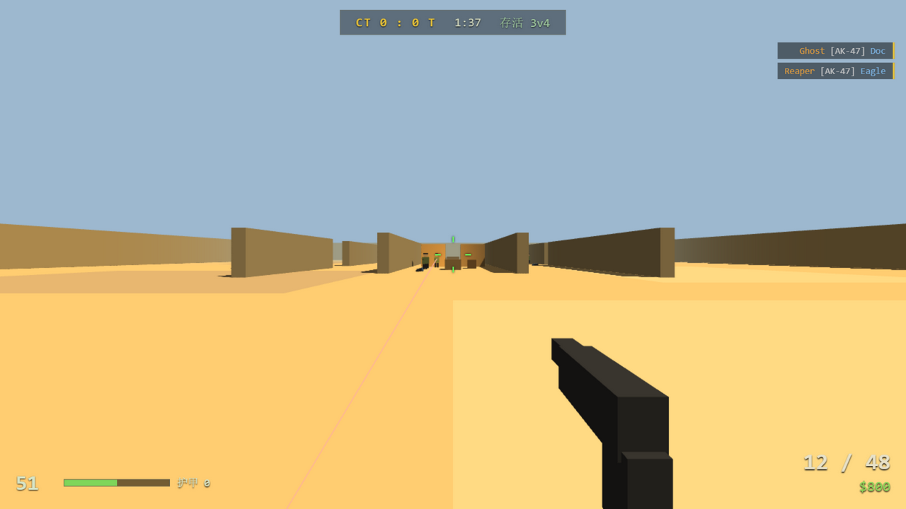

# WEB-STRIKE 1.7 · 网页版反恐精英致敬

纯 Three.js + WebAudio 实现的 CS 1.6 风格第一人称射击网页游戏。**零依赖、零构建、零游戏原始资产**——所有音效由 WebAudio 实时合成，所有模型由代码搭建的几何体构成，开箱即玩。



## 玩法

- **4 张地图**：沙城废墟（经典三线）、砖巷小镇（红砖窄巷）、雪夜仓库（夜战室内）、远射靶场（开阔狙击位）
- **3 种模式**：
  - **经典歼灭**——回合制 5v5，购买装备、逐回合歼灭，先赢目标回合数获胜
  - **团队死斗**——阵亡 3 秒重生，随时购买，先达到击杀目标的队伍获胜（限时 6 分钟）
  - **军备竞赛**——每次击杀升级下一把武器，走完 12 级军备链并用小刀完成最后一杀者胜
- **16 种武器**：手枪（USP / Glock-18 / 沙漠之鹰）、微冲（MP5 / P90）、步枪（Galil / FAMAS / AK-47 / M4A1 / AUG / SG552）、狙击（SSG-08 / AWP / G3SG1）、重火力（XM1014 霰弹 / M249）+ 战术刀
- **4 档 AI 难度**：新手 / 普通 / 困难 / 精英——影响反应速度、命中率、伤害、爆头率与配枪水平（难度越高，bot 的枪越好）
- **自定义比赛**：主菜单可直接调整地图、模式、难度、队伍规模（2v2 ~ 9v9）、胜利目标、回合限时、起始金钱、鼠标灵敏度、音量，设置自动保存
- 经济系统：击杀 / 回合结算发放金钱（上限 $16000）；爆头 4 倍伤害；战术刀背刺一刀秒杀；重武器有移速惩罚
- **购买菜单沿用 CS1.6 原版编号**：B→1 手枪 / 2 霰弹枪 / 3 微冲 / 4 步枪 / 5 机关枪 / 6 主弹药 / 7 副弹药 / 8 装备——B→4→2 就是 AK-47，B→3→3 是 MP5，B→8→2 买防弹衣+头盔；原版未收录的枪（如 P228）编号空缺保留
- 防弹衣 $650 / 防弹衣+头盔 $1000（头盔减免爆头伤害）；弹药按匣补给（主 $60、副 $25）
- 阵亡后进入队友观战视角（经典模式回合继续；死斗 / 军备模式倒计时重生）

## 操作

| 按键 | 功能 |
|---|---|
| W A S D | 移动 |
| 鼠标 | 瞄准 · 左键射击 |
| 右键 | 开镜（AUG / SG552 2x · SSG-08 2.5x · G3SG1 3x · AWP 4x） |
| Shift | 静步 |
| Ctrl / C | 蹲下 |
| 空格 | 跳跃 |
| R | 换弹 |
| B | 购买菜单（CS1.6 原版编号，如 B→4→2 = AK-47） |
| 1 / 2 / 3 | 主武器 / 手枪 / 战术刀 |
| Esc | 暂停（可退出至主菜单） |

## 运行

无需安装任何依赖，二选一：

- 直接双击打开 `cs16.html`
- 或起任意静态服务器后访问，例如：

  ```bash
  python -m http.server 8080
  # 打开 http://localhost:8080/cs16.html
  ```

需要支持 WebGL 的现代浏览器（Chrome / Edge / Firefox）。

## 在线游玩（不下载，直接开网页）

CNB 平台本身不提供 GitHub Pages 式的静态托管，可用**云开发预览**直接开玩：

1. 打开仓库 [cnb.cool/OASIS-Art3mis/webcs](https://cnb.cool/OASIS-Art3mis/webcs)，点 **云开发** 进入 WebIDE
2. 在终端执行 `python3 -m http.server 8080`（默认监听 0.0.0.0，符合端口预览要求）
3. 在 WebIDE 的 **PORTS** 面板添加 `8080` 端口，打开生成的转发地址（形如 `https://xxxx-8080.cnb.run`）即可开玩

> 工作区停止后地址失效，下次进入重复第 2、3 步即可。

## 技术要点

- **Three.js** 渲染（本地 `three.min.js`，离线可玩）
- 自实现碰撞与射线：AABB 滑墙移动、slab 法射线检测、视线（LOS）判定
- **多地图系统**：声明式地图定义（调色板 / 雾效 / 光照 / 障碍 / 路点 / 出生点），运行时整场重建
- **Bot AI**：路点巡逻、视线感知（分帧节流）、难度化反应延迟与命中模型、距离管理 + 横移、狙击手保持距离、军备竞赛持刀冲锋、卡死脱困、枪声吸引
- **WebAudio 全合成音效**：手枪 / 步枪 / 微冲 / 霰弹 / 狙击等差异化枪声，脚步 / 换弹 / 挥刀 / 命中反馈，无任何音频文件
- 霰弹枪多弹丸射线与聚合结算；武器开镜分级与开镜灵敏度自适应
- 粒子血雾 / 枪口火光 / 曳光弹（共享材质，低 GC 压力）
- HUD 脏检查更新，避免每帧 DOM 写入
- 调试模式：URL 加 `#shot`（或 `#shot1` ~ `#shot3` 指定地图）进入冻结 AI 的取景模式；控制台 `WSDBG` 可手动步进模拟帧（自动化测试用）

## 目录结构

```
webcs/
├── cs16.html        # 页面、HUD、主菜单与样式
├── game.js          # 全部游戏逻辑（单文件）
├── three.min.js     # Three.js 本地副本
└── docs/
    └── screenshot.png
```

## 说明

本项目为向经典致敬的同人原型，与 Valve 无关，不含任何游戏原始资产。
